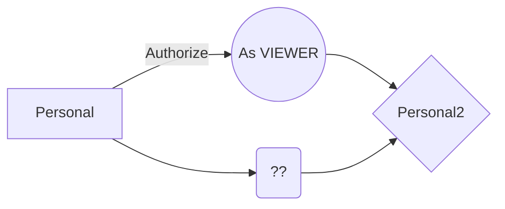
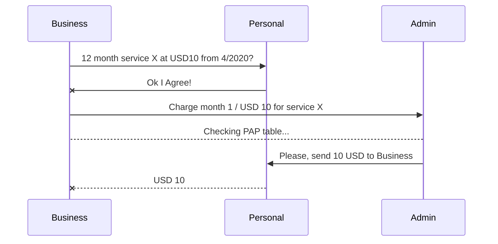

CristalNetwork EOSIO Smart Contracts
=

This is a step by step guide to launch an instance of CristalNetwork Bank DApp.
The doc will cover both deploying options: 
  - deploying the Smart Contract on Local Single-Node Testnet and 
  - deploying the Smart Contract on Jungle Testnet.

> **IMPORTANT note**: If you are going to run a Local Single-Node Testnet you should install and run **Hyperion History API** after installing the node. Please refer to [this github link](https://github.com/eosrio/Hyperion-History-API) and [this eosrio.io link](https://web.eosrio.io/hyperion/) for further information.
> **IMPORTANT note 2**: After releasing this doc I found [this guide about installing and running a Local Single-Node Testnet](https://developers.eos.io/manuals/eos/latest/nodeos/usage/development-environment/local-single-node-testnet).

This doc will try to guide you through:
1. Setting up the EOSIO dev environment, 
1. Running Local Single-Node Testnet
1. Creating EOSIO accounts 
1. Compiling EOSIO Smart Contracts
1. Deploying Dapp (Smart Contracts for CristalNetwork Bank Instance)

> [EOSIO Intro](https://developers.eos.io/welcome/latest/overview/core_concepts)

## Setup Dev Environment
For both deploying the Smart Contract on Local Single-Node Testnet and deploying the Smart Contract on Jungle Testnet, we suggest you to have a local instance of `cleos`.

1. Follow [this EOS tutorial steps from scratch up to point 2.2](https://developers.eos.io/eosio-home/docs/10-big-picture). After that step, please check you have achieved:
  a. Runnig `cleos` at your local machine. 
  b. Having a local wallet and several accounts.
  c. Being able to compile and deploy a Smart Contract.


2. Create 1 (one) admin account. 
This guide will use `qwertyasdfgh` as the account name. Please choose a meaningful name because the account name will be the identifier of the contract. 
Respect this rules when choosing an account name:
    > Can only contain the characters `abcdefghijklmnopqrstuvwxyz12345` (a-z lowercase letters and 1-5 digits).
    > Must start with a letter.
    > 12 character length.
  
  a. Create a private/public key pair. You can run the following command:
  ```bash cleos create key --to-console 
  Private key: 5Hq2mRUipJ92gwzxqN6fvjg8dvRyhv66guFFqTBKf4sju7q1q4M
  Public key: EOS7v7pPMDhiNm8LURc4yXoCWZg3otjKYeHqVdpF5dPg925ckebRM
  ```
  b. Create the account.
  If you are running a Local Single-Node Testnet instance, run the following command:
  ```bash
  cleos create account eosio qwertyasdfgh EOS7v7pPMDhiNm8LURc4yXoCWZg3otjKYeHqVdpF5dPg925ckebRM -p eosio@active
  ```
  > If you are using **Jungle Testnet**, go to [monitor.jungletestnet.io](https://monitor.jungletestnet.io/#account) and paste account name and public key 

3. Get some EOS tokens.
This step is onlye useful if your are using **Jungle Testnet**, otherwise go to the next step.
[Use this this faucet to issue tokens to your account](https://api.monitor.jungletestnet.io/#faucet).

4. Import created account to your local wallet. 
Execut this command to import created private keys.
  ```bash 
    $ cleos wallet import --private-key <PRIVATE_KEY>
  ```
You can take a look at [this link](https://developers.eos.io/eosio-cleos/reference#cleos-wallet-import) to get further information.

## Compile and deploy Bank's Smart Contract

#### 1. Clone this repo
```bash
cd /local_directory_for/cristalnetwork/
git clone [https://github.com/cristalnetwork/inkiri-eos-contracts](https://github.com/cristalnetwork/inkiri-eos-contracts)
```
#### 2. Compile
If this is the first time you compile a contract, please run the following commands. Otherwise go to next step.
```bash
eosio-init -path=/local_directory_for/cristalnetwork/inkiri-eos-contracts/cristaltoken -project=qwertyasdfgh
cd /local_directory_for/cristalnetwork/inkiri-eos-contracts/cristaltoken
mkdir build
cd build
cmake ..
```
Compile the contract
```bash
cd /local_directory_for/cristalnetwork/inkiri-eos-contracts/cristaltoken/build
make -j4
```
> Compilation reference [at this link](https://developers.eos.io/manuals/eosio.cdt/latest/installation)
> Note: The `-j4` argument indicates the number of core to use during compilation. The number should be less or equal than the amount of cpu your computer has.

#### 3. Publish and deploy the Bank Contract
```bash
cleos wallet unlock --password XXXXXXXXXXXXX
cleos set account permission qwertyasdfgh active --add-code
cleos set contract qwertyasdfgh /local_directory_for/cristalnetwork/inkiri-eos-contracts/cristaltoken/build/cristaltoken --abi cristaltoken.abi -p qwertyasdfgh@active
```
If you are using _testnet_, please run the following command:
```bash
cleos wallet unlock --password XXXXXXXXXXXXX
cleos -u http://jungle2.cryptolions.io:80 set account permission qwertyasdfgh active --add-code
cleos -u http://jungle2.cryptolions.io:80 set contract qwertyasdfgh /local_directory_for/cristalnetwork/inkiri-eos-contracts/cristaltoken/build/cristaltoken --abi cristaltoken.abi -p qwertyasdfgh@active
```
#### 4. Create the Bank Contract Token
If you are using _testnet_, you may need to buy some RAM. Use this command to accomplish that:
```bash
cleos -u http://jungle2.cryptolions.io:80 system buyram qwertyasdfgh qwertyasdfgh --kbytes 1000
```

To create a new token, call  `create`  action with the correct parameters. This action accepts 1 argument, it consists of:
-   An issuer that is an eosio account. In this case, it's  `qwertyasdfgh`. This issuer will be the one with the authority to call  `issue`  and/or perform other actions such as closing accounts or retiring tokens.
-   An  `asset`  type composed of two pieces of data, a floating-point number sets the maximum supply and a  `symbol`  in capitalized alpha characters which represents the asset. For example, "1.0000 CNT" (Cristal Network Token), or "1.0000 INK" (Inkiri token).
```bash
cleos push action qwertyasdfgh create '[ "qwertyasdfgh", "1000000000.0000 INK"]' -p qwertyasdfgh@active
```
> Note: replace INK with your preferred token symbol.
> Reference [https://developers.eos.io/welcome/latest/getting-started/smart-contract-development/deploy-issue-and-transfer-tokens](https://developers.eos.io/welcome/latest/getting-started/smart-contract-development/deploy-issue-and-transfer-tokens)

#### 5. Configure Bank Admin
In order to get admin permissions, run the following command:
 ```bash
cleos push action qwertyasdfgh upsertcust '{"to":"qwertyasdfgh", "fee":"0.0000 INK", "overdraft":"0.0000 INK", "account_type":4, "state":1, "memo":""}' -p qwertyasdfgh@active
 ```
 > If you are using _testnet_, please append `-u http://jungle2.cryptolions.io:80` after `cleos`.

#### 6.  Add a bank customer and issue some tokens
The account named `qwertyasdfgh` will now add a new customer to the bank, set an overdraft of "1000.0000 INK", check that balance, and then issue some tokens.
Please, create a new account named `bankcustomer`.
##### Create account `bankcustomer`
1. Create a private/public key pair. You can run the following command:
    ```bash
    $ cleos create key --to-console
    Private key: 5KNzaA3jL69KuGpn3xrdc6b12FfGtEGVqVd94UJKnAjLNTq4CWa
    Public key: EOS5tkKVxt8xKZzK9YnR8dpLXUyMivtrCKugmqNdXwX178rrZHBTB
    ```
2. Create the account.
    - If you are using _testnet_, please folow the next steps:
      * Go to [monitor.jungletestnet.io](https://monitor.jungletestnet.io/#account) and paste account name and public key 
    - If you are running a Local Single-Node Testnet instance, run the following command:
  ```bash
  cleos create account eosio bankcustomer EOS5tkKVxt8xKZzK9YnR8dpLXUyMivtrCKugmqNdXwX178rrZHBTB -p eosio@active
  ```
#####  Add `bankcustomer` as a new customer.
```bash
cleos push action qwertyasdfgh upsertcust '{"to":"bankcustomer", "fee":"5.0000 INK", "overdraft":"1000.0000 INK", "account_type":1, "state":1, "memo":""}' -p qwertyasdfgh@active
```
##### Check `bankcustomer` balance.
```bash
cleos get currency balance qwertyasdfgh bankcustomer INK
```
Expected result: `1000.0000 INK`
##### Issue more tokens to `bankcustomer`.
```bash
cleos push action qwertyasdfgh issue '[ "bankcustomer", "99.0000 INK", "deposit.1" ]' -p qwertyasdfgh@active
```
##### Check `bankcustomer` balance.
```bash
cleos get currency balance qwertyasdfgh bankcustomer INK
```
Expected result: `1099.0000 INK`

## Account types
There are 4 (four) account types.
```
constexpr static   uint32_t     TYPE_ACCOUNT_PERSONAL      = 1;
constexpr static   uint32_t     TYPE_ACCOUNT_BUSINESS      = 2;
constexpr static   uint32_t     TYPE_ACCOUNT_FOUNDATION    = 3;
constexpr static   uint32_t     TYPE_ACCOUNT_BANK_ADMIN    = 4;
```
> [Source code](https://github.com/cristalnetwork/inkiri-eos-contracts/blob/master/cristaltoken/include/cristaltoken.hpp#L155)

_missing text_


## Account permissions
> [EOSIO Accounts and Permissions](https://developers.eos.io/welcome/latest/protocol/accounts_and_permissions)


#### Point of Sale (POS/PDV)
_missing text_


## Overdraft
_missing text_


## Pre Authorized Debit / Pre Authorized Payment
_missing text_


#### (As a personal account) Authorize business to debit authomatically from my account balance
_missing text_
#### (As a business account) Claim PAD
_missing text_

## Explorers
|                |MAINNET                          |TESTNET                         |
|----------------|-------------------------------|-----------------------------|
|EOS|[http://bloks.io](http://bloks.io/)            |[https://jungle.bloks.io](https://jungle.bloks.io/)            |
|TELOS          |[https://telos.bloks.io](https://telos.bloks.io/)           |[https://telos-test.bloks.io](https://telos-test.bloks.io/)            |
